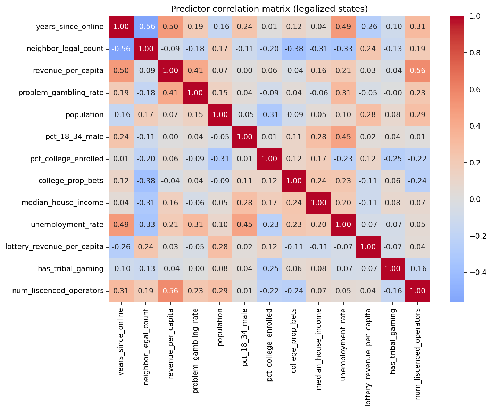
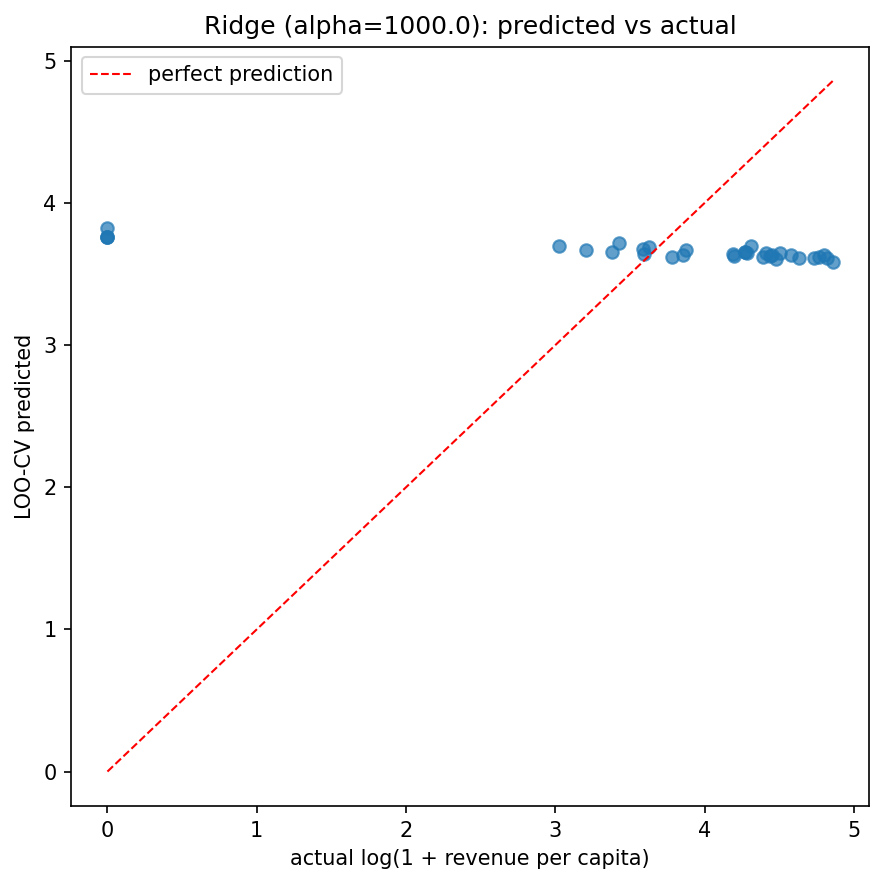
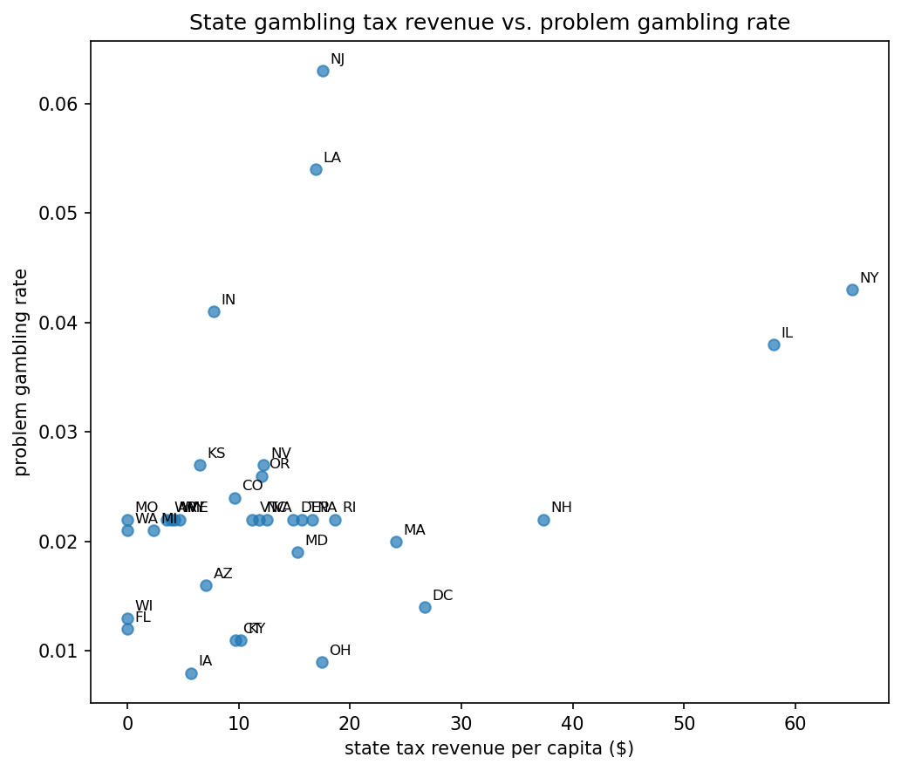

# Sports Gambling Data

[](https://colab.research.google.com/github/simonpr0/Sports_Gambling_Exploratory_Analysis/blob/main/data.ipynb)


## Overview

With the rise of sports gambling, mostly online, I was intrigued about the data behind it —
specifically how much the betting giants profit off their customers, how much money states make
off betting taxes, and whether the benefits outweigh the costs. This project analyzes US
state-level legalization, revenue, and demographic data to answer three questions:

1. **Which states without legal online sports betting are most likely to legalize it next?**
2. **What predicts revenue per capita among states that have already legalized it?**
3. **Is the revenue states collect from legalization actually beneficial**, once weighed against
   what the data can say about cost?

Click the "Open in Colab" badge above to run the full analysis in your browser — no local setup
required. I want to eventually extend this into underage online gambling and the
volume/targeting of gambling advertising, both of which I think are headed for controversy.

## Key findings

**1. Predictor correlations (legalized states)** — checked for multicollinearity before fitting
the revenue models:



**2. The legalization model separates states reasonably well** (see the notebook for the current
LOO AUC and full holdout ranking) — South Carolina, Mississippi, and Georgia currently rank as
the most "legalization-ready" holdout states based on lottery revenue, unemployment, and
neighboring-state legalization patterns.

**3. The revenue model does not generalize.** With only 33–34 usable rows and 7+ predictors, LOO
cross-validated R² is negative for every regularization strength tried, including after cutting
down to the 3 most correlated predictors. The in-sample OLS R² (~0.82) is not meaningful here —
it reflects overfitting, not real explanatory power. This is a data volume problem, not a
modeling one; it should improve as more states legalize and the sample grows.



**4. Industry revenue isn't state revenue.** `revenue_per_capita` in the dataset is gross gaming
revenue (what sportsbooks take in), not what the state collects — that's
`revenue_per_capita * tax_rate`. Nevada leads every state in GGR per capita but taxes it at only
6.75%, so its actual state take per capita drops out of the top 8 once tax rate is accounted for,
while high-tax states like New York and New Hampshire (both 51%) move up. Any claim about "how
much states benefit" that uses raw revenue figures is measuring the wrong thing.

**5. On cost:** `problem_gambling_rate` is a prevalence rate, not a dollar figure. State tax
revenue per capita correlates weakly-to-modestly with it (r ≈ 0.38) — consistent with more
betting activity driving both, not evidence the tax revenue itself is harmful. No sign of lottery
revenue being cannibalized by sports betting revenue in this snapshot (r ≈ 0.25, weakly positive,
though this is cross-sectional and can't establish before/after substitution).



**6. A real dollar figure, with a real limit.** `pg_services_spend_per_capita_2023` is actual
state spending on problem gambling prevention/treatment, transcribed from a
[NAADGS/Problem Gambling Solutions report](https://naadgs.org/wp-content/uploads/2024/06/2023-Budget-Update-of-Publicly-Funded-Problem-Gambling-Services-USA.pdf).
Netting it against `state_tax_revenue_per_capita` gives a **net fiscal benefit** that's positive
for every legalized state in this dataset except three showing $0 state tax revenue (Florida,
Washington, Wisconsin — their sports betting runs through tribal compacts not captured as taxed
commercial revenue here). But this is a *fiscal* net, not a *social* one: state PG spend doesn't
correlate with problem gambling rate (r ≈ 0.07), and academic estimates of the full social cost
per problem gambler (healthcare, lost productivity, bankruptcy, crime) run from roughly
$1,200–$10,000+/year — well above what states currently allocate per capita. If real social costs
scale anywhere near that, the picture could look very different from the fiscal-only numbers.

**Bottom line:** nothing here says the revenue isn't worth it, but nothing here can say it is,
either — the fiscal side looks positive almost everywhere, but a real verdict needs the
full-social-cost data this dataset still doesn't have.

**7. A first step toward panel data.** `betting_data_panel.csv` adds real annual state population
(Census Population Estimates Program, 2020–2024) and two years of PG-services spend per capita
(2023, 2024). The national average rose ($0.47 → $0.52/capita), but the state-level picture is
mixed — Massachusetts, Oregon, and Kansas grew the most while Minnesota and Maryland cut back —
and the year-over-year change doesn't correlate with state tax revenue growth (r ≈ 0.08),
reinforcing that these budgets move on legislative earmarks, not measured need or revenue.
A longer sports-betting-*revenue* time series was attempted and deliberately dropped: the
available sources either only cover 2 years cleanly, bundle in unrelated tax categories, or only
exist in a format unreliable to extract at scale (see Limitations).

## Methodology

- **Data**: `betting_data.csv` — one row per US state (51, including DC), with legalization
  status/timing, revenue, demographics, and political/economic covariates. `betting_data_panel.csv`
  — a state-year panel (2020–2024) with real annual population and 2 years of PG-services spend.
- **Legalization model**: logistic regression, features standardized, evaluated with
  leave-one-out cross-validation (LOO-CV) given the small sample.
- **Revenue model**: OLS for an in-sample read, then Ridge + LOO-CV across a range of
  regularization strengths for an honest out-of-sample estimate.
- **Cost vs. benefit**: descriptive correlation between state tax revenue per capita, tax rate,
  lottery revenue, problem gambling rate, and real (sourced) state problem-gambling-services
  spending per capita — no causal claims, and the spending figure is a fiscal floor, not a full
  social-cost estimate.

Full code and narrative are in [`data.ipynb`](data.ipynb).

## Limitations

- Small sample (33–51 states depending on model) relative to the number of predictors.
- `betting_data.csv` is cross-sectional (one snapshot) for revenue and demographics — no
  before/after or causal claims are possible from it. `betting_data_panel.csv` is a real annual
  panel, but only for population (2020–2024) and PG-services spend (2023–2024 only) — 2 years is
  too short to call a trend.
- No full monetized social-cost data for problem gambling — `problem_gambling_rate` is a
  prevalence rate, and `pg_services_spend_per_capita_2023`/`2024` is state mitigation spending
  (from a single external report, values read off charts to the nearest $0.10), not the broader
  economic burden (healthcare, lost productivity, bankruptcy, crime).
- A multi-year sports-betting-revenue panel was attempted and dropped. Census's tax data only
  breaks out a "sports betting" category starting late 2023, and that category explicitly bundles
  in pari-mutuel (horse/dog racing) betting per Census's own classification manual — confirmed by
  non-legal-sports-betting states (Alabama, Texas) showing nonzero values. The industry's own
  multi-year source (AGA's annual "State of the States" reports) has true sports-betting-only
  figures, but only inside per-state narrative writeups, not a clean table — extracting that
  reliably for every state across several years was judged not worth the effort/error trade-off.
- Lottery revenue is single-snapshot only. A real historical series exists (Census's
  "Income and Apportionment of State-Administered Lottery Funds" table), but it's gated behind a
  Census API key tied to a registered email, which wasn't pursued in this pass.

## Setup

```bash
pip install -r requirements.txt
jupyter notebook data.ipynb
```

Or skip local setup entirely and use the [Colab link](https://colab.research.google.com/github/simonpr0/Sports_Gambling_Exploratory_Analysis/blob/main/data.ipynb) above.
